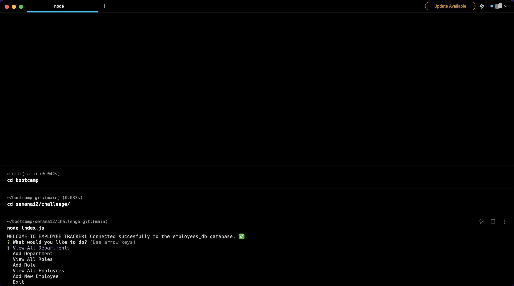

# SQL - Employee Tracker

## The Task

For Challenge #12 the task was to create an interface to easily view and interact with information of a employees database. This interface is a command-line application that uses Node.js, Inquirer and MySQL. The user can interact running the application in the command-line and manipulating the information of the employees database easily through inquirer options. 

Because this application is not deployed, a demostrate video link is added in Mock-Up section. 


## Given User Story

```md
AS A business owner
I WANT to be able to view and manage the departments, roles, and employees in my company
SO THAT I can organize and plan my business
```

## Mock-Up

The following video shows an example of the application being used from the command line:

[](https://drive.google.com/file/d/1FLBap3p-tH3RXVpkInrHozMRQTT2ApRy/view?usp=sharing)


- - -
© 2023 edX Boot Camps LLC. Confidential and Proprietary. All Rights Reserved. Code developed by María Fernanda Marroquín. 
